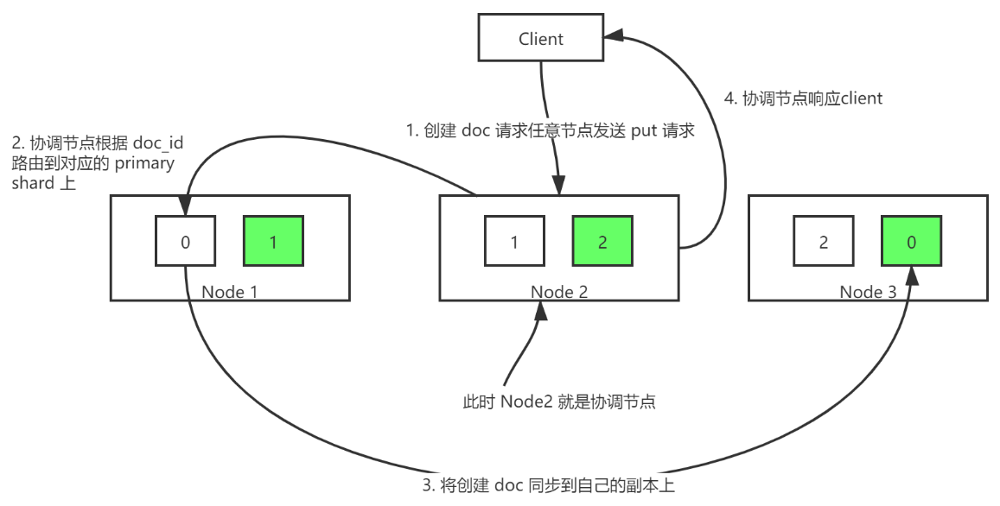
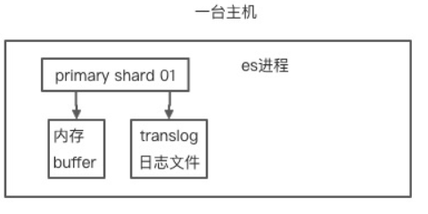
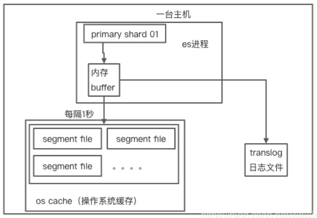
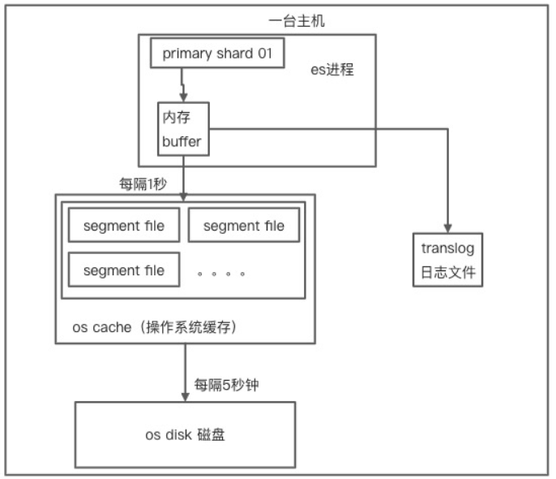

# ElasticSearch

### 基础认知：

#### 数据分类

- 结构化数据
- 非结构化数据

#### 搜索方式

- 顺序扫描法
- 全文搜索

#### 常见搜索引擎

- Lucene：是一个Java全文搜索引擎 完全用Java编写
  Lucene不是一个完整的应用程序，而是一个代码库和API，可以很容易地用于向应用程序添加搜索功能
- Solr：Solr是基于Lucene的Java库构建的开源搜索平台
  它能提供分布式索引，复制，负载均衡以及自动故障转移和恢复。如果它被正确部署然后管理的好，他就能够成为一个高可用，可扩展且容错的搜索引擎
- ElasticSearch：elasticsearch 基于 lucene，隐藏了 lucene 的复杂性，提供了简单易用的 restful api / Java api 接口
  它提供了一个分布式，多租户能力的全文搜索引擎，具有HTTP Web页面和无架构JSON文档。

### 环境安装

### 基础概念

##### 索引(index)：

索引可以理解为关系型数据库中的库

##### 类型(type)：

类型可以看作关系型数据库中的表
需要注意的时候ES 7之后没有类型的概念了（ES 5一个索引中可以有多个类型、ES 6一个索引只能有一个类型）

##### 映射(mapping)：

映射定义了所有的字段信息 相当与关系型数据库中的表结构

##### 文档(document)：

相当于关系型数据库中的一行记录

##### 字段(field)：

基本相当于关系型数据库的字段

##### 分片和副本(shard)：

分片有主分片(primary Shard)和副本分片(replica Shard)之分 副本是分片的副本
一个Index数据在屋里上被分布在多个主分片中 每个主分片只存放部分数据
每个主分片可以有多个副本 叫副本分片 是主分片的复制

### 脚本记录

~~~json
条件查询:
GET sec_report/_search
{
    "query":{
      "match":{
        "字段名称": ""
        }
    }
}

ID删除:
DELETE sec_report/_doc/1309

条件删除:
POST sec_report_element/_delete_by_query
{
    "query":{
      "match":{
        "字段名称": ""
        }
    }
}

添加：
POST sec_report/_doc/8185
{
  "id":8185,
  "industryName":"制造业",
  "fileName":"江海股份深度报告20130819.pdf",
  "docType":"research_report","rating":"推荐",
  "fileCode":"5b6715130d414d1c17c122f14d186bfb.pdf",
  "postOrg":"长江证券",
  "remark" : "",
  "message":"成功",
  "scanFlag":"0",
  "reportType":"1",
  "parseDate":"2013-08-19 04:08:04",
  "analystName":"枯木逢春犹再发"
}

分词：
GET _analyze
{
    "text":"分词内容",
    "analyzer":"分词器名称"
}

添加映射：
PUT sec_report/_doc/_mapping
{
  "properties": {
    "authorization" : {
      "type" : "text",
      "analyzer" : "aliws",
      "search_analyzer" : "aliws"
    }
  }
}

~~~

### 常用命令

~~~bash
# 修改 最大结果集：
curl -k --header "Content-Type: application/json;charset=UTF-8" --user elastic:Elastic#123 -XPUT http://29.118.128.239:59200/sec_report/_settings -d '{ "index" : { "max_result_window" : "10000"}}'

# 修改 测试mapping：
curl -H "Content-Type: application/json;charset=UTF-8" --user elastic:Elastic#123 -XPUT "http://29.118.128.239:59200/sec_test/_doc/_mapping?pretty" -d '
{
  "properties": {
    "deviceKeyword": {
        "type": "text", 
        "analyzer": "ik_max_word", 
        "search_analyzer": "aliws"
    }
}}'

# 修改 sec_report mapping：
curl -H "Content-Type: application/json;charset=UTF-8" --user elastic:Elastic#123 -XPUT "http://29.118.128.239:59200/sec_report/_doc/_mapping?pretty" -d '
{
  "properties": {
    "analystName" : {
      "type" : "text",
      "analyzer" : "aliws",
      "search_analyzer" : "aliws"
    },
    "remark" : {
      "type" : "text",
      "analyzer" : "aliws",
      "search_analyzer" : "aliws"
    },
    "fileParse": {
      "type" : "text",
      "analyzer" : "aliws",
      "search_analyzer": "aliws"
    }
  }
}'
# 查看sec_report映射
curl --user elastic:Elastic#123 -GET "http://29.118.128.239:59200/sec_report/_doc/_mapping?pretty"

# 修改 sec_report_element mapping：
curl -H "Content-Type: application/json;charset=UTF-8" --user elastic:Elastic#123 -XPUT "http://29.118.128.239:59200/sec_report_element/_doc/_mapping?pretty" -d '
{
  "properties": {
    "analystName" : {
      "type" : "text",
      "analyzer" : "aliws",
      "search_analyzer" : "aliws"
    },
    "elementInfo": {
      "type" : "text",
      "analyzer" : "aliws",
      "search_analyzer": "aliws"
    }
  }
}'

# 查看sec_report_element映射
curl --user elastic:Elastic#123 -GET "http://29.118.128.239:59200/sec_report_element/_doc/_mapping?pretty"
~~~

### SCORE评分

Lucene（或 Elasticsearch）使用 [*布尔模型（Boolean model）*](http://en.wikipedia.org/wiki/Standard_Boolean_model) 查找匹配文档，并用一个名为 [*实用评分函数（practical scoring function）*](https://www.elastic.co/guide/cn/elasticsearch/guide/2.x/practical-scoring-function.html) 的公式来计算相关度。这个公式借鉴了 [*词频/逆向文档频率（term frequency/inverse document frequency）*](http://en.wikipedia.org/wiki/Tfidf) 和 [*向量空间模型（vector space model）*](http://en.wikipedia.org/wiki/Vector_space_model)，同时也加入了一些现代的新特性，如协调因子（coordination factor），字段长度归一化（field length normalization），以及词或查询语句权重提升。

> ##### 词频/逆向文档频率

当匹配到一组文档后，需要根据相关度排序这些文档，不是所有的文档都包含所有词，有些词比其他的词更重要。**一个文档的相关度评分部分取决于每个查询词在文档中的权重** 。

词的权重由三个因素决定

Elasticsearch 的相似度算法被定义为检索词频率/反向文档频率 TF/IDF

- **检索词频率**

  检索词在该字段出现的频率？出现频率越高，相关性也越高。 字段中出现过 5 次要比只出现过 1 次的相关性高。

- **反向文档频率**

  每个检索词在索引中出现的频率？频率越高，相关性越低。检索词出现在多数文档中会比出现在少数文档中的权重更低。

- **字段长度准则**

  字段的长度是多少？长度越长，相关性越低。 检索词出现在一个短的 title 要比同样的词出现在一个长的 content 字段权重更大。

### springboot 整合

1. 引入依赖

   ~~~xml
   <dependency>
       <groupId>org.springframework.boot</groupId>
       <artifactId>spring-boot-starter-data-elasticsearch</artifactId>
   </dependency>
   ~~~

2. 配置文件

   ~~~yaml
   # es配置
   es:
     username: elastic
     password: elasticsearch123
     host: localhost
     port: 9200
   ~~~

3. 配置类

   ~~~java
   @Configuration
   public class ElasticsearchConfig extends AbstractElasticsearchConfiguration {
   
       @Value("${es.username}")
       String userName;
   
       @Value("${es.password}")
       String password;
   
       @Value("${es.host}")
       String host;
   
       @Value("${es.port}")
       int port;
   
       //设置ES官方的高级客户端
       @Bean
       @Override
       public RestHighLevelClient elasticsearchClient() {
           //设置用户名密码
           CredentialsProvider credentialsProvider = new BasicCredentialsProvider();
           credentialsProvider.setCredentials(
                   AuthScope.ANY, new UsernamePasswordCredentials(userName, password)
           );
   
           //设置连接地址
           HttpHost[] httpHosts = new HttpHost[1];
           httpHosts[0] = new HttpHost(host, port);
   
           //设置连接客户端
           RestHighLevelClient restHighLevelClient = new RestHighLevelClient(
                   RestClient.builder(httpHosts)
                           .setHttpClientConfigCallback(
                                   httpAsyncClientBuilder ->
                                           httpAsyncClientBuilder.setDefaultCredentialsProvider(credentialsProvider)
                           )
           );
           return restHighLevelClient;
       }
   
       @Bean
       public RequestOptions requestOptions() {
           return RequestOptions.DEFAULT;
       }
   }
   ~~~

4. 编写工具类

   ~~~java
   @Service
   public class ElasticsearchUtil {
   
       @Resource
       RestHighLevelClient client;
       @Resource
       RequestOptions requestOptions;
   
       //region 索引操作
       public boolean checkIndex(String indexName) {
           boolean exists = false;
           try {
               GetIndexRequest getIndex = new GetIndexRequest(indexName);
               exists = client.indices().exists(getIndex, requestOptions);
           } catch (IOException e) {
               log.error("checkIndex ==》 校验异常");
           }
           return exists;
       }
   
       public boolean createIndex(Class indexClass) {
           Annotation annotation = indexClass.getAnnotation(ESIndex.class);
           if (annotation != null)
               return createIndex(((ESIndex) annotation).indexName(), mappingBuilder(indexClass));
           else
               return false;
       }
   
       public boolean createIndex(String indexName, XContentBuilder builder) {
           boolean flag = false;
           if (checkIndex(indexName))
               return flag;
           try {
               CreateIndexRequest createIndex = new CreateIndexRequest(indexName);
               createIndex.mapping(builder);
               Settings settings = Settings.builder()
                       .put("number_of_replicas", 0)
                       .build();
               createIndex.settings(settings);
   
               CreateIndexResponse response = client.indices().create(createIndex, requestOptions);
               flag = response.isAcknowledged();
           } catch (IOException e) {
               log.error("createIndex ==》 创建异常");
           }
           return flag;
       }
   
       public boolean deleteIndex(String indexName) {
           boolean flag = false;
           if (!checkIndex(indexName))
               return flag;
           try {
               DeleteIndexRequest deleteIndex = new DeleteIndexRequest(indexName);
               AcknowledgedResponse response = client.indices().delete(deleteIndex, requestOptions);
               flag = response.isAcknowledged();
           } catch (IOException e) {
               log.error("deleteIndex ==》 删除异常");
           }
           return flag;
       }
   
       public XContentBuilder mappingBuilder(Map<String, String> prop) {
           XContentBuilder xContentBuilder = null;
           try {
               xContentBuilder = XContentFactory.jsonBuilder();
               xContentBuilder.startObject();
               {
                   xContentBuilder.startObject("properties");
                   for (String name : prop.keySet()) {
                       xContentBuilder.startObject(name);
                       xContentBuilder.field("type", prop.get(name));
                       xContentBuilder.endObject();
                   }
                   xContentBuilder.endObject();
               }
               xContentBuilder.endObject();
           } catch (IOException e) {
               log.error("mappingBuilder ==》 映射关系构建异常");
           }
           return xContentBuilder;
       }
   
       public XContentBuilder mappingBuilder(Class esIndex) {
           Annotation annotation = esIndex.getAnnotation(ESIndex.class);
           if (annotation == null)// 没有索引注解 不生效
               return null;
           else {
               XContentBuilder xContentBuilder = null;
               Field[] declaredFields = esIndex.getDeclaredFields();
               try {
                   xContentBuilder = XContentFactory.jsonBuilder();
                   xContentBuilder.startObject();
                   {
                       xContentBuilder.startObject("properties");
                       for (Field field : declaredFields) {
                           ESField fieldAnnotation = field.getAnnotation(ESField.class);
                           if (fieldAnnotation != null) {
                               if (StrUtil.isNotBlank(fieldAnnotation.fieldName()))
                                   xContentBuilder.startObject(fieldAnnotation.fieldName());
                               else
                                   xContentBuilder.startObject(field.getName());
                               xContentBuilder.field("type", fieldAnnotation.type().getType());
                               if (fieldAnnotation.analyzer().getAnalyzer() != null)
                                   xContentBuilder.field("analyzer", fieldAnnotation.analyzer().getAnalyzer());
                               if (fieldAnnotation.type() == ESTypeEnum.DATE && StrUtil.isNotBlank(fieldAnnotation.format()))
                                   xContentBuilder.field("format", fieldAnnotation.format());
                               xContentBuilder.endObject();
                           }
                       }
                       xContentBuilder.endObject();
                   }
                   xContentBuilder.endObject();
               } catch (IOException e) {
                   log.error("mappingBuilder ==》 映射关系构建异常");
               }
               return xContentBuilder;
           }
       }
       //endregion
   
       //region 文档操作
   
       public boolean checkDocumentByID(String indexName, String id) {
           boolean exists = false;
           try {
               GetRequest get = new GetRequest();
               get.index(indexName);
               get.id(id);
               exists = client.exists(get, requestOptions);
           } catch (IOException e) {
               log.error("checkDocument ==》 校验异常");
           }
           return exists;
       }
   
       //region doc 新增
       public <ES extends ESObject> void insertDoc(String indexName, ES es) {
           try {
               client.index(docIndexRequest(indexName, es), requestOptions);
           } catch (IOException e) {
               log.info("insertDoc ==》 文档新增异常");
           }
       }
   
       private <ES extends ESObject> IndexRequest docIndexRequest(String indexName, ES es) throws JsonProcessingException {
           ObjectMapper json = new ObjectMapper();
           IndexRequest doc = new IndexRequest(indexName);
           doc.id(es.getId());
           doc.source(json.writeValueAsString(es), XContentType.JSON);
           return doc;
       }
   
       public <ES extends ESObject> void insertDocBatch(String indexName, List<ES> esList) {
           try {
               BulkRequest bulk = new BulkRequest();
               for (ES es : esList)
                   bulk.add(docIndexRequest(indexName, es));
               client.bulk(bulk, requestOptions);
           } catch (IOException e) {
               log.info("insertDoc ==》 文档批量新增异常");
           }
       }
       //endregion
   
       //region doc 更新
       public <ES extends ESObject> void updateDoc(String indexName, ES es) {
           try {
               client.update(docUpdateRequest(indexName, es), requestOptions);
           } catch (IOException e) {
               log.info("updateDoc ==》 文档更新异常");
           }
       }
   
       private <ES extends ESObject> UpdateRequest docUpdateRequest(String indexName, ES es) throws JsonProcessingException {
           ObjectMapper json = new ObjectMapper();
           UpdateRequest doc = new UpdateRequest(indexName, es.getId());
           doc.setRefreshPolicy(WriteRequest.RefreshPolicy.IMMEDIATE);
           doc.doc(json.writeValueAsString(es), XContentType.JSON);
           return doc;
       }
   
       public <ES extends ESObject> void updateDocBatch(String indexName, List<ES> esList) {
           try {
               BulkRequest bulk = new BulkRequest();
               for (ES es : esList)
                   bulk.add(docUpdateRequest(indexName, es));
               client.bulk(bulk, requestOptions);
           } catch (IOException e) {
               log.info("insertDoc ==》 文档批量更新异常");
           }
       }
       //endregion
   
       //region doc 更新
       public void deleteDoc(String indexName, String id) {
           try {
               client.delete(new DeleteRequest(indexName, id), requestOptions);
           } catch (IOException e) {
               log.info("deleteDoc ==》 文档删除异常");
           }
       }
   
       public void deleteDocBatch(String indexName, List<String> idList) {
           try {
               BulkRequest bulk = new BulkRequest();
               for (String id : idList)
                   bulk.add(new DeleteRequest(indexName, id));
               client.bulk(bulk, requestOptions);
           } catch (IOException e) {
               log.info("insertDoc ==》 文档批量新增异常");
           }
       }
       //endregion
   
       //endregion
   
       //region 数据查询
   
       //region 基础查询
       /**
        * 查询
        *
        * @param indexName
        * @param objClass
        * @param searchSourceBuilder
        * @param <ES>
        * @return
        */
       public <ES extends ESObject> ESPage<ES> search(String indexName, Class<ES> objClass, SearchSourceBuilder searchSourceBuilder) {
           ESPage<ES> esPage = new ESPage<ES>() {
               {
                   setPageNum(searchSourceBuilder.from());
                   setPageSize(searchSourceBuilder.size());
               }
           };
           List<ES> hits = new ArrayList<>();
           //高亮字段 只处理一个字段
           List<String> higFields = searchSourceBuilder.highlighter().fields().stream()
                   .map(field -> field.name()).collect(Collectors.toList());
           String higField = higFields.size() > 0 ? higFields.get(0) : null;
           try {
               SearchRequest request = new SearchRequest(indexName);
               request.source(searchSourceBuilder);
               SearchResponse response = client.search(request, requestOptions);
               long total = response.getHits().getTotalHits().value;
               esPage.setTotal(total);
               esPage.setTotalPage((int) Math.ceil((double) total / esPage.getPageSize()));
               for (SearchHit hit : response.getHits().getHits()) {
                   Map<String, Object> item = hit.getSourceAsMap();
                   ES es = BeanUtil.mapToBean(item, objClass, false, new CopyOptions());
                   es.setId(hit.getId());
                   es.setScore(hit.getScore());
                   hits.add(es);
                   //region 高亮处理 保留高亮内容
                   if (StrUtil.isNotEmpty(higField) && hit.getHighlightFields().size() > 0) {
                       HighlightField hField = hit.getHighlightFields().get(higField);
                       if (hField != null)
                           es.setHigtext(Arrays.stream(hField.fragments()).map(
                                   h -> h.toString()
                           ).collect(Collectors.toList()));
                   }
                   //endregion
               }
           } catch (IOException e) {
               e.printStackTrace();
           }
           esPage.setList(hits);
           return esPage;
       }
   
       /**
        * 查询
        *
        * @param indexName
        * @param objClass
        * @param searchSourceBuilder
        * @param <ES>
        * @return
        */
       public <ES extends ESObject> ESPage<ES> searchMore(String indexName, Class<ES> objClass, SearchSourceBuilder searchSourceBuilder) {
           ESPage<ES> esPage = new ESPage<ES>() {
               {
                   setPageNum(searchSourceBuilder.from());
                   setPageSize(searchSourceBuilder.size());
               }
           };
           List<ES> hits = new ArrayList<>();
           try {
               SearchRequest request = new SearchRequest(indexName);
               request.source(searchSourceBuilder);
               SearchResponse response = client.search(request, requestOptions);
               long total = response.getHits().getTotalHits().value;
               esPage.setTotal(total);
               esPage.setTotalPage((int) Math.ceil((double) total / esPage.getPageSize()));
               for (SearchHit hit : response.getHits().getHits()) {
                   Map<String, Object> item = hit.getSourceAsMap();
                   ES es = BeanUtil.mapToBean(item, objClass, false, new CopyOptions());
                   es.setId(hit.getId());
                   es.setScore(hit.getScore());
                   hits.add(es);
               }
           } catch (IOException e) {
               e.printStackTrace();
           }
           esPage.setList(hits);
           return esPage;
       }
       //endregion
   
       //region 单条件查询
       public <ES extends ESObject> ESPage<ES> searchMatch(String indexName, Class<ES> objClass, SearchVo search) {
           return search(indexName, objClass, new SearchSourceBuilder()
                   .query(QueryBuilders.matchQuery(search.getField(), search.getValue().getValue()))
                   .highlighter(new HighlightBuilder().field(search.getField())
                           .preTags("")
                           .postTags("")
                   )
                   .from(search.getFrom())
                   .size(search.getSize())
           );
       }
   
       public <ES extends ESObject> ESPage<ES> searchTerm(String indexName, Class<ES> objClass, SearchVo search) {
           return search(indexName, objClass, new SearchSourceBuilder()
                   .query(QueryBuilders.termQuery(search.getField(), search.getValue().getValue()))
                   .highlighter(new HighlightBuilder().field(search.getField())
                           .preTags("")
                           .postTags("")
                   )
                   .from(search.getFrom())
                   .size(search.getSize())
           );
       }
   
       public <ES extends ESObject> ESPage<ES> searchRanges(String indexName, Class<ES> objClass, SearchVo search) {
           return search(indexName, objClass, new SearchSourceBuilder()
                   .query(QueryBuilders.rangeQuery(search.getField())
                           .gte(search.getValue().getGte())
                           .gt(search.getValue().getGt())
                           .lte(search.getValue().getLte())
                           .lt(search.getValue().getLt()))
                   .highlighter(new HighlightBuilder().field(search.getField())
                           .preTags("")
                           .postTags("")
                   )
                   .from(search.getFrom())
                   .size(search.getSize())
           );
       }
       //endregion
   
       //region 多条件查询
   
       /**
        * 多条件组合查询
        *
        * @param indexName      索引名称
        * @param objClass       索引对象
        * @param searchsMust    must条件集合
        * @param searchsMustNot mustnot 条件集合
        * @param searchsShould  should 条件集合
        * @param <ES>
        * @return
        */
       public <ES extends ESObject> ESPage<ES> search(String indexName, Class<ES> objClass,
                                                      List<SearchVo> searchsMust,
                                                      List<SearchVo> searchsMustNot,
                                                      List<SearchVo> searchsShould,
                                                      int from,
                                                      int size) {
           SearchSourceBuilder searchSourceBuilder = new SearchSourceBuilder();
           BoolQueryBuilder boolQueryBuilder = QueryBuilders.boolQuery();
           searchBuilderMust(boolQueryBuilder, searchsMust);
           searchBuilderMustNot(boolQueryBuilder, searchsMustNot);
           searchBuilderShould(boolQueryBuilder, searchsShould);
           searchSourceBuilder.query(boolQueryBuilder)
                   .from(from)
                   .size(size);
           return searchMore(indexName, objClass, searchSourceBuilder);
       }
   
       //region searchMust
   
       /**
        * 多条件查询 must
        *
        * @param indexName
        * @param objClass
        * @param searchs
        * @param <ES>
        * @return
        */
       public <ES extends ESObject> ESPage<ES> searchMust(String indexName, Class<ES> objClass, List<SearchVo> searchs) {
           return searchMust(indexName, objClass, searchs, searchs.get(0).getFrom(), searchs.get(0).getSize());
       }
   
       /**
        * 多条件查询 must
        *
        * @param indexName
        * @param objClass
        * @param searchs
        * @param from
        * @param size
        * @param <ES>
        * @return
        */
       public <ES extends ESObject> ESPage<ES> searchMust(String indexName, Class<ES> objClass, List<SearchVo> searchs, int from, int size) {
           SearchSourceBuilder searchSourceBuilder = new SearchSourceBuilder();
           searchSourceBuilder.query(searchBuilderMust(QueryBuilders.boolQuery(), searchs))
                   .from(from)
                   .size(size);
           return searchMore(indexName, objClass, searchSourceBuilder);
       }
       //endregion
   
       //region searchMustNot
   
       /**
        * 多条件查询 mustnot
        *
        * @param indexName
        * @param objClass
        * @param searchs
        * @param <ES>
        * @return
        */
       public <ES extends ESObject> ESPage<ES> searchMustNot(String indexName, Class<ES> objClass, List<SearchVo> searchs) {
           return searchMustNot(indexName, objClass, searchs, searchs.get(0).getFrom(), searchs.get(0).getSize());
       }
   
       /**
        * 多条件查询 mustnot
        *
        * @param indexName
        * @param objClass
        * @param searchs
        * @param <ES>
        * @return
        */
       public <ES extends ESObject> ESPage<ES> searchMustNot(String indexName, Class<ES> objClass, List<SearchVo> searchs, int from, int size) {
           SearchSourceBuilder searchSourceBuilder = new SearchSourceBuilder();
           searchSourceBuilder.query(searchBuilderMustNot(QueryBuilders.boolQuery(), searchs))
                   .from(from)
                   .size(size);
           return searchMore(indexName, objClass, searchSourceBuilder);
       }
       //endregion
   
       //region searchShould
   
       /**
        * 多条件查询 should
        *
        * @param indexName
        * @param objClass
        * @param searchs
        * @param <ES>
        * @return
        */
       public <ES extends ESObject> ESPage<ES> searchShould(String indexName, Class<ES> objClass, List<SearchVo> searchs) {
           return searchShould(indexName, objClass, searchs, searchs.get(0).getFrom(), searchs.get(0).getSize());
       }
   
       /**
        * 多条件查询 should
        *
        * @param indexName
        * @param objClass
        * @param searchs
        * @param <ES>
        * @return
        */
       public <ES extends ESObject> ESPage<ES> searchShould(String indexName, Class<ES> objClass, List<SearchVo> searchs, int from, int size) {
           SearchSourceBuilder searchSourceBuilder = new SearchSourceBuilder();
           searchSourceBuilder.query(searchBuilderShould(QueryBuilders.boolQuery(), searchs))
                   .from(from)
                   .size(size);
           return searchMore(indexName, objClass, searchSourceBuilder);
       }
       //endregion
   
       //endregion
   
       //region 查询封装
   
       /**
        * 封装boolQueryBuilder对象 - Must
        *
        * @param boolQueryBuilder
        * @param searchs
        * @return
        */
       private BoolQueryBuilder searchBuilderMust(BoolQueryBuilder boolQueryBuilder, List<SearchVo> searchs) {
           for (SearchVo search : searchs) {
               if (ObjUtil.isNull(search))
                   continue;
               switch (search.getSearchType()) {
                   case MATCH:
                       boolQueryBuilder.must(QueryBuilders.matchQuery(search.getField(), search.getValue().getValue()));
                       break;
                   case TERM:
                       boolQueryBuilder.must(QueryBuilders.termQuery(search.getField(), search.getValue().getValue()));
                       break;
                   case RANGE:
                       boolQueryBuilder.must(QueryBuilders.rangeQuery(search.getField())
                               .gt(search.getValue().getGt())
                               .gte(search.getValue().getGte())
                               .lt(search.getValue().getLt())
                               .lte(search.getValue().getLte()));
                       break;
                   case WILDCARD:
                       boolQueryBuilder.must(QueryBuilders.wildcardQuery(search.getField(), search.getValue().getValue().toString()));
                       break;
                   case REGEXP:
                       boolQueryBuilder.must(QueryBuilders.regexpQuery(search.getField(), search.getValue().getValue().toString()));
                       break;
                   case PREFIX:
                       boolQueryBuilder.must(QueryBuilders.prefixQuery(search.getField(), search.getValue().getValue().toString()));
                       break;
                   case FUZZY:
                       boolQueryBuilder.must(QueryBuilders.fuzzyQuery(search.getField(), search.getValue().getValue().toString()));
                       break;
                   default:
                       break;
               }
           }
           if (searchs.size() > 0 && boolQueryBuilder.must().size() > 0)
               return boolQueryBuilder;
           else
               return boolQueryBuilder;
       }
   
       /**
        * 封装boolQueryBuilder对象 - MustNot
        *
        * @param boolQueryBuilder
        * @param searchs
        * @return
        */
       private BoolQueryBuilder searchBuilderMustNot(BoolQueryBuilder boolQueryBuilder, List<SearchVo> searchs) {
           for (SearchVo search : searchs) {
               if (ObjUtil.isNull(search))
                   continue;
               switch (search.getSearchType()) {
                   case MATCH:
                       boolQueryBuilder.mustNot(QueryBuilders.matchQuery(search.getField(), search.getValue().getValue()));
                       break;
                   case TERM:
                       boolQueryBuilder.mustNot(QueryBuilders.termQuery(search.getField(), search.getValue().getValue()));
                       break;
                   case RANGE:
                       boolQueryBuilder.mustNot(QueryBuilders.rangeQuery(search.getField())
                               .gt(search.getValue().getGt())
                               .gte(search.getValue().getGte())
                               .lt(search.getValue().getLt())
                               .lte(search.getValue().getLte()));
                       break;
                   case WILDCARD:
                       boolQueryBuilder.mustNot(QueryBuilders.wildcardQuery(search.getField(), search.getValue().getValue().toString()));
                       break;
                   case REGEXP:
                       boolQueryBuilder.mustNot(QueryBuilders.regexpQuery(search.getField(), search.getValue().getValue().toString()));
                       break;
                   default:
                       break;
               }
           }
           if (searchs.size() > 0 && boolQueryBuilder.must().size() > 0)
               return boolQueryBuilder;
           else
               return boolQueryBuilder;
       }
   
       /**
        * 封装boolQueryBuilder对象 - Should
        *
        * @param boolQueryBuilder
        * @param searchs
        * @return
        */
       private BoolQueryBuilder searchBuilderShould(BoolQueryBuilder boolQueryBuilder, List<SearchVo> searchs) {
           for (SearchVo search : searchs) {
               if (ObjUtil.isNull(search))
                   continue;
               switch (search.getSearchType()) {
                   case MATCH:
                       boolQueryBuilder.should(QueryBuilders.matchQuery(search.getField(), search.getValue().getValue()));
                       break;
                   case TERM:
                       boolQueryBuilder.should(QueryBuilders.termQuery(search.getField(), search.getValue().getValue()));
                       break;
                   case RANGE:
                       boolQueryBuilder.should(QueryBuilders.rangeQuery(search.getField())
                               .gt(search.getValue().getGt())
                               .gte(search.getValue().getGte())
                               .lt(search.getValue().getLt())
                               .lte(search.getValue().getLte()));
                       break;
                   case WILDCARD:
                       boolQueryBuilder.should(QueryBuilders.wildcardQuery(search.getField(), search.getValue().getValue().toString()));
                       break;
                   case REGEXP:
                       boolQueryBuilder.should(QueryBuilders.regexpQuery(search.getField(), search.getValue().getValue().toString()));
                       break;
                   default:
                       break;
               }
           }
           if (searchs.size() > 0 && boolQueryBuilder.must().size() > 0)
               return boolQueryBuilder;
           else
               return boolQueryBuilder;
       }
   
       //endregion
   
       //endregion
   }
   ~~~

   

## 集群

### 数据分片

#### 概念

数据分片：Elasticsearch提供了将索引划分成多份的能力
在创建的时候指定分片数量 (分片数量创建后就不能变更 因为会根据分片数进行索引 改了就找不到数据了)
每个分片本身也是一个功能完善并且独立的“索引”

数据分片的目的：

- 分片能让你水平分割你的数据
- 分片在不同的机器上部署 达到扩容的目的
- 在分片上进行分布式的、并行的操作，进而提高性能/吞吐量

### 复制机制

- 在分片/节点失败的情况下 复制提供了高可用性
- 扩展你的搜索量/吞吐量 因为搜索可以在所有的复制上并行运行

## 原理

### 倒排索引

我们传统的检索方式是通过遍历整篇文章 逐个比对找到对应的关键词位置
而倒排索引是通过分词策略，形成词和文章的关系映射表，这种*词典+映射表的方式就是倒排索引*，有点类似于我们以前使用的新华字典。倒排索引可极大的提高查询效率。

### 数据插入

#### 大致逻辑

- 首先在协调节点根据路由规则计算出文档要分配到的分片
  在从集群元数据中找出对应主分片的位置
- 请求接着会发送给对应的主分片
- 在主分片上执行成功后 请求将被同步发送到从分片
- 从分片写入成功后返回成功

#### 详细

1. 协调节点

> 1. ingest pipeline：是一个请求预处理的管道，会根据规则对请求进行预处理工作
>    它会查看请求是否符合某个 ingest pipeline 的 pattern, 如果符合则执行 pipeline 中的逻辑，一般是对文档进行各种预处理，如格式调整，增加字段等。
> 2. 自动创建索引：判断索引是否存在，如果开启了自动创建则自动创建，否则报错。
> 3. 设置 routing：获取请求 URL 或 mapping 中的 _routing，如果没有则使用 _id，如果没有指定 _id 则 ES 会自动生成一个全局唯一 ID。该 _routing 字段用于决定文档分配在索引的哪个 shard 上。
> 4. 构建 BulkShardRequest：创建多操作请求，假设 Bulk Request 中包含多种（Index/Update/Delete）请求，同时这些请求需要在不同分片上执行。
>    需要通过这个步骤将请求按照分片进行区分，同一个分片上的请求聚合到一起，从而构建 BulkShardRequest。
> 5. 将请求发送给 primary shard：用户请求如果是写操作，会将请求路由到主分片所在的节点，并且等待主分片写入结果的返回信息。

2. 主分片

> 1. 判断操作类型：如果是 Bulk Request 会遍历请求中的子操作，根据不同的操作类型跳转到不同的处理逻辑。
> 2. 操作转换：将 Update 操作转换为 Index 和 Delete 操作。
> 3. 解析文档（Parse Doc）：解析文档的各字段。
> 4. 更新 Mapping：如果请求中有新增字段，会根据 dynamic mapping 或 dynamic template 生成对应的 mapping，如果 mapping 中有 dynamic mapping 相关设置则按设置处理。
> 5. 获取 sequence Id 和 Version：从 SequenceNumberService 获取一个 SequenceID 和 Version。
>    SequenceID 用于初始化 LocalCheckPoint，version 是根据当前 versoin+1 用于防止并发写导致数据不一致。
> 6. 写入 Lucene：对索引文档 uid 加锁，然后判断 uid 对应的 version v2 和之前 update 转换时的 version v1 是否一致，不一致则返回第二步重新执行。
>    在 version 一致的情况下根据id的情况执行添加或者更新操作。如果同 id 的 doc 已经存在，则调用 updateDocument 接口。
> 7. 写入 translog：写入 Lucene 的 Segment 后，会以 key value 的形式写 Translog， Key 是 Id，Value 是索引文档的内容。
>    当查询的时候，如果请求的是 GetDocById 则可以直接根据 _id 从 translog 中获取。写入 translog 的操作会在下面的章节中详细讲解。
> 8. 重构 bulk request：已经多个操作中的 update 操作转换为 index、delete 操作，最终都以 index 或 delete 操作的方式组成 bulk request 请求。
> 9. 落盘 Translog：默认情况下，translog 要在此处落盘完成，如果对可靠性要求不高，可以设置 translog 异步落盘，同时存在数据有丢失的风险。
> 10. 发送请求给副本分片：将构造好的 bulk request 发送给各个副本分片，并且等待副本分片返回，然后再响应协调节点。如果某个分片执行失败，主分片会给主节点发请求移除该分片。
> 11. 等待 replica 响应：当所有的副本分片返回请求时，更新主分片的 LocalCheckPoint。

3. 从分片逻辑大致与主分片相同

### 刷盘逻辑

1. 分片接收到数据后 先将数据写入内存buffer缓冲区 （可以开启 translog日志文件）
   在这个步骤es还不能查询到数据
   
2. 每隔1秒 ES有个刷新操作（或者在内存buffer满了的时候也会触发）
   它会将内存buffer中的数据会写入主机操作系统的缓存中并且产生一个segment file文件
   并清空内存buffer 在这个步骤es已经可以查询到数据了 （es数据是准实时 因为有一秒延迟）
   
3. 时间长了系统内存中的Segment文件会比较多 所以Segment文件会进行合并去重
   Segment的大小也不是无限的 所以需要写入磁盘中 写入磁盘之前会创建一个Commit Point文件
   这个文件用来记录Segment的去向 这个过程是Flush

上面有提到translog文件
这里单独说一下 因为按照上面的通过内存写入磁盘的方式 可能会造成数据丢失 所以需要translog文件
translog文件会将每个请求都落入磁盘（但是比较影响性能 所以建议开启异步写入translog）
另外在es进行Flush操作的时候 translog也会进行一次落盘操作
落盘操作之后旧的translog文件会被移除 会创建新的

### 删除更新逻辑

删除和更新也都是写操作 但是 Elasticsearch 中的文档是不可变的 因此不能被删除或者改动
我们在执行删除的时候 其实不是真正的删除了这个文档
磁盘上每一个段都有一个.del文件 删除的时候会把文档 在.del文件标记为已删除
但是在匹配查询的时候依旧能匹配到 只是会在结果中把它过滤掉

更新也是一样的 也会把旧的文档在.del文件中标记为已删除
但是查询结果中也是能查到 只是在结果中会把标记了已删除的文件过滤掉

## 面试题

### 优化

时间滚动方式创建索引 避免单个索引很大的情况出现

### 读写一致

由乐观锁保证 

